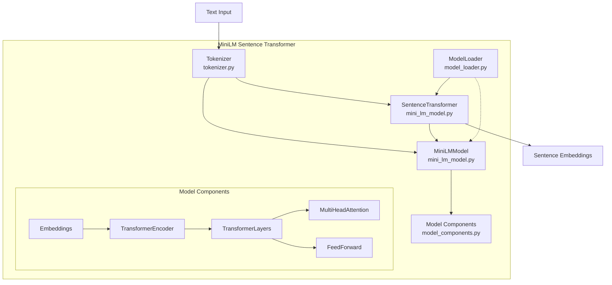

# MiniLM Sentence Transformer Implementation

A PyTorch implementation of the MiniLM transformer model for generating sentence embeddings, supporting multiple model variants including:

- `paraphrase-MiniLM-L3-v2`
- `all-MiniLM-L6-v2` (default)
- `paraphrase-MiniLM-L6-v2`
- `all-MiniLM-L12-v2`

This implementation provides efficient sentence embedding generation with customizable parameters, making it suitable for both experimentation and production use.

## Features

- Custom PyTorch implementation of the MiniLM architecture
- Support for multiple model variants (L3, L6, and L12)
- Loading pretrained weights from HuggingFace models
- Configurable sequence length and model parameters
- GPU/MPS acceleration with automatic device detection
- Robust parameter validation and error checking

## Requirements

```
torch>=1.7.0
transformers>=4.6.0
numpy>=1.19.0
```

## Architecture



### Core Modules

- **model_components.py**: Transformer building blocks (Embeddings, Attention, etc.)
- **mini_lm_model.py**: Core model implementation (`MiniLMModel`, `SentenceTransformer`)
- **model_loader.py**: Handles loading pretrained weights from HuggingFace models
- **tokenizer.py**: Text tokenization and encoding
- **usage_example.py**: Command-line interface and usage examples

### Data Flow

1. **Text → Embeddings**:
   - Text input → Tokenizer → Token IDs & attention mask
   - Token IDs → Embeddings → Transformer layers → Mean pooling → Normalized sentence embeddings

2. **Weight Loading**:
   - HuggingFace model → Custom architecture mapping → Parameter validation → Loaded weights

## Environment Setup

1. Set up the environment variable for model paths:
```bash
export LLM_MODELS_PATH=/path/to/your/models
```

2. Install the required packages:
```bash
pip install -r requirements.txt
```

3. Download model files from HuggingFace to your LLM_MODELS_PATH directory.

## Usage

### Basic Usage

```python
from mini_lm_model import SentenceTransformer
from tokenizer import MiniLMTokenizer
from model_loader import load_pretrained_weights
import torch

# Initialize with appropriate parameters
model = SentenceTransformer(num_hidden_layers=6, max_length=64)
tokenizer = MiniLMTokenizer(model_name="all-MiniLM-L6-v2", max_length=64)

# Load pretrained weights
model = load_pretrained_weights(model, model_name="all-MiniLM-L6-v2")

# Prepare sentences
sentences = [
    "The quick brown fox jumps over the lazy dog",
    "I love natural language processing"
]

# Tokenize sentences
encoded_input = tokenizer.encode(sentences)

# Move to appropriate device (CUDA, MPS, or CPU)
device = torch.device("cuda" if torch.cuda.is_available() else 
                     "mps" if torch.backends.mps.is_available() else 
                     "cpu")
model.to(device)
encoded_input = {k: v.to(device) for k, v in encoded_input.items()}

# Generate embeddings
with torch.no_grad():
    embeddings = model(encoded_input["input_ids"], encoded_input["attention_mask"])
```

### Command-Line Usage

```bash
# Default: all-MiniLM-L6-v2, max_length=64
python usage_example.py

# Using specific model and max_length
python usage_example.py --model all-MiniLM-L12-v2 --max_length 128
```

## Model Selection Guide

| Model | Layers | Hidden Size | Parameters | Best For |
|-------|--------|-------------|------------|----------|
| paraphrase-MiniLM-L3-v2 | 3 | 384 | ~22M | Fast inference, low resources |
| all-MiniLM-L6-v2 | 6 | 384 | ~33M | Balanced performance (default) |
| paraphrase-MiniLM-L6-v2 | 6 | 384 | ~33M | Better paraphrase quality |
| all-MiniLM-L12-v2 | 12 | 384 | ~55M | Higher quality embeddings |

## License

This project is licensed under the MIT License - see the [LICENSE](LICENSE) file for details.

## Acknowledgments

This implementation is based on the MiniLM architecture from Microsoft Research and the HuggingFace Transformers library.