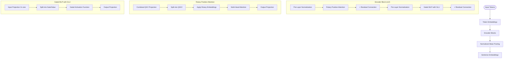
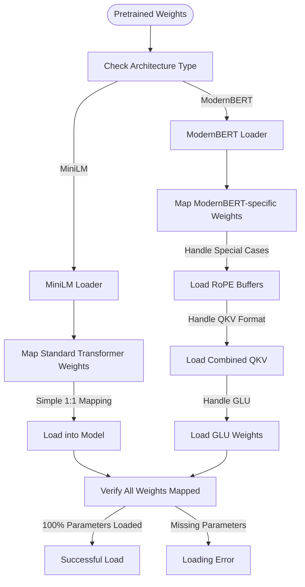

# Sentence Transformer Implementation

A clean, modular implementation of transformer models for generating sentence embeddings and text classification. This project focuses on two key transformer architectures: MiniLM and ModernBERT.

## Features

- Implementation of two distinct transformer architectures:
  - MiniLM: Efficient, lightweight transformer model
  - ModernBERT: Advanced transformer with modern architecture improvements
- Sentence embedding generation for similarity tasks
- Text classification capabilities
- Clean, modular codebase with clear separation of architectures
- Support for HuggingFace models and SafeTensors format

## Model Architectures

### MiniLM Architecture

MiniLM follows a traditional transformer design with several optimizations for efficiency:


**Key Features of MiniLM:**
- Traditional positional embeddings added to token embeddings
- Post-layer normalization (after each sub-layer)
- Separate Q/K/V projection matrices in attention mechanism
- Standard feed-forward network with GELU activation
- Available in 3 sizes: L3 (3 layers), L6 (6 layers), and L12 (12 layers)
- Hidden size of 384 (compared to BERT's 768)
- Maximum sequence length of 512 tokens
- Pooling options: CLS token or mean pooling

### ModernBERT Architecture

ModernBERT incorporates several modern improvements to the transformer architecture:



**Key Features of ModernBERT:**
- Rotary Position Embeddings (RoPE) instead of absolute position embeddings
- Pre-layer normalization (before each sub-layer)
- Combined QKV projection matrix in attention mechanism
- Gated Linear Unit (GLU) activation in feed-forward layers
- Asymmetric MLP dimensions for improved efficiency
- Support for longer contexts (up to 8192 tokens)
- No bias terms in layer normalization for stability
- Mean pooling with normalization for sentence embeddings

## Project Structure

```
sentence_transformer/
├── src/                       # Main package
│   ├── models/                # Model implementations
│   │   ├── components.py      # Shared transformer building blocks
│   │   ├── minilm/            # MiniLM specific implementation
│   │   │   └── model.py       # MiniLM model architecture
│   │   ├── modernbert/        # ModernBERT specific implementation
│   │   │   └── model.py       # ModernBERT model architecture  
│   │   └── transformer.py     # Common transformer interfaces
│   ├── utils/                 # Utilities
│   │   ├── minilm_loader.py   # MiniLM weight loading functions
│   │   ├── model_loader.py    # Generic model loading interface
│   │   ├── modernbert_loader.py # ModernBERT weight loading functions
│   │   └── tokenizer.py       # Tokenization utilities
│   ├── data_utils/            # Dataset generation and handling
│   │   └── generator.py       # Dataset generation functions
│   └── examples/              # Example applications
│       ├── text_similarity.py   # Sentence similarity example
│       ├── classification.py    # Text classification example
│       └── transformer_example.py # Combined example script
├── data/                      # Data directory for examples (CSV files)
├── generate_data.py           # Script to generate datasets
├── test_installation.py       # Script to verify installation
├── setup.py                   # Package setup file
├── requirements.txt           # Package dependencies
└── README.md                  # This file
```

## Installation

```bash
# Install from source
pip install -e .

# Install dependencies
pip install -r requirements.txt
```

## Usage

### Generate Datasets (for classification)

```bash
# Generate classification datasets
python generate_data.py
```

### Sentence Similarity

```bash
# Run text similarity example
python src/examples/transformer_example.py --mode similarity --model minilm-l6
```

### Text Classification

```bash
# First generate the datasets
python generate_data.py

# Then run text classification example
python src/examples/transformer_example.py --mode classification --model minilm-l6 --epochs 5
```

### Verify Installation

```bash
# Run quick test to verify everything works
python test_installation.py
```

## Architecture Comparison

The table below highlights the key architectural differences between MiniLM and ModernBERT:

| Feature | MiniLM | ModernBERT |
|---------|--------|------------|
| Position Encoding | Absolute embeddings | Rotary embeddings (RoPE) |
| Layer Normalization | Post-layer norm | Pre-layer norm |
| Attention Mechanism | Separate Q/K/V projections | Combined QKV projection |
| Feed-Forward Network | Standard with GELU | Gated Linear Unit (GLU) |
| MLP Dimensions | Symmetric | Asymmetric (Wi larger than Wo) |
| Sequence Length | 512 tokens | Up to 8192 tokens |
| Typical Layers | 3, 6, or 12 | 12 to 22 |
| Hidden Size | 384 | 768 |
| LN Bias | Yes | No |

## Technical Highlights

### MiniLM

MiniLM is a lightweight transformer model that distills knowledge from larger models while maintaining good performance:

1. **Efficient Knowledge Distillation**: Designed to distill knowledge from larger models like BERT
2. **Layer Configurations**: Available in 3, 6, or 12 layer variants for different tradeoffs
3. **Post-Layer Normalization**: Uses the original transformer architecture with normalization after each sublayer
4. **Pooling Strategies**: Supports both CLS token and mean pooling for sentence embeddings

### ModernBERT

ModernBERT incorporates several architectural innovations that have emerged since the original transformer architecture:

1. **Rotary Position Embeddings (RoPE)**: Instead of adding absolute position embeddings, ModernBERT uses rotation matrices that modify query and key vectors directly within the attention mechanism, enabling better extrapolation to longer sequences.

2. **Gated Linear Units (GLU)**: The traditional feed-forward network is replaced with a gated architecture:
   ```
   FFN(x) = (xWi1 * SiLU(xWi2)) * Wo
   ```
   Where Wi1 and Wi2 are computed from a single larger projection, and SiLU is the Sigmoid Linear Unit activation function.

3. **Pre-Layer Normalization**: Layer normalization is applied before each sublayer rather than after, improving training stability.

4. **Combined QKV Projection**: Uses a single projection matrix for Q, K, and V, which is then split, reducing parameter count.

5. **Normalized Mean Pooling**: Uses mean pooling with normalization for improved sentence embeddings.

## Model Selection Guide

| Model | Description | Parameters | Best For |
|-------|-------------|------------|----------|
| minilm-l3 | 3-layer model (fastest) | ~14M | Resource-constrained environments, edge devices |
| minilm-l6 | 6-layer model (balanced) | ~23M | General-purpose use, balanced performance |
| minilm-l12 | 12-layer model (highest quality) | ~33M | High-quality embeddings, similarity tasks |
| modernbert | Advanced transformer architecture | ~110M | State-of-the-art performance, longer contexts |

## Code Examples

### MiniLM Example

```python
from src.models.minilm import create_minilm_model
from src.utils import get_tokenizer_for_model, load_pretrained_weights

# Create model and tokenizer
model = create_minilm_model(num_layers=6)
tokenizer = get_tokenizer_for_model("minilm-l6")

# Load weights
model = load_pretrained_weights(model, "all-MiniLM-L6-v2")

# Generate embeddings
texts = ["This is a sample sentence.", "Another example text."]
encoded = tokenizer.encode(texts)
embeddings = model(encoded['input_ids'], encoded['attention_mask'])

# Calculate similarity
import torch
cosine = torch.nn.CosineSimilarity(dim=1)
similarity = cosine(embeddings[0].unsqueeze(0), embeddings[1].unsqueeze(0))
print(f"Similarity: {similarity.item():.4f}")
```

### ModernBERT Example

```python
from src.models.modernbert import create_modernbert_model
from src.utils import get_tokenizer_for_model, load_pretrained_weights

# Create model and tokenizer
model = create_modernbert_model()
tokenizer = get_tokenizer_for_model("modernbert")

# Load weights
model = load_pretrained_weights(model, "modernbert-base")

# Generate embeddings (supports longer sequences)
texts = ["This is a detailed technical document...", "Another complex text with many details..."]
encoded = tokenizer.encode(texts, max_length=2048, truncation=True)
embeddings = model(encoded['input_ids'], encoded['attention_mask'])

# Calculate similarity
import torch
cosine = torch.nn.CosineSimilarity(dim=1)
similarity = cosine(embeddings[0].unsqueeze(0), embeddings[1].unsqueeze(0))
print(f"Similarity: {similarity.item():.4f}")
```

## Implementation Details

### Weight Loading

One of the key technical challenges in this project is correctly loading weights from pretrained models into our implementations:



#### MiniLM Weight Loading

MiniLM uses a standard transformer architecture, making weight loading straightforward:
- Direct 1:1 mapping between source and target parameters
- Standard naming conventions (query, key, value projections)
- Conventional position embeddings
- Typical layer normalization parameters

#### ModernBERT Weight Loading

ModernBERT requires special handling for its architectural innovations:

1. **Rotary Embeddings**: Instead of loading learned position embeddings, we:
   - Register cos/sin buffers based on the model's configuration
   - Compute these values during initialization rather than loading them
   - Use appropriate frequency calculations for positional encoding

2. **Combined QKV Handling**: When loading weights:
   - Convert separate Q/K/V matrices to combined format if needed
   - Handle dimension rearrangement for multi-head attention
   - Support different head dimensions between source and target

3. **GLU Weights**: For the gated feed-forward networks:
   - Split larger Wi matrix into two parts (gate and value paths)
   - Handle asymmetric dimensions between input and output projections
   - Map activation functions appropriately (GELU/SiLU)

4. **Parameter Grouping**: For fine-tuning we use:
   - Separate parameter groups for encoder vs. classifier layers
   - Different learning rates for different parameter groups
   - Layer-dependent learning rate decay for deeper transformer models

## Performance Considerations

- **MiniLM**: Optimized for efficiency and smaller model size
  - Uses approximately 1/4 the parameters of BERT-base
  - Suitable for resource-constrained environments
  - Good balance of performance and speed

- **ModernBERT**: Optimized for quality and long-sequence handling
  - Advanced architecture with better scaling properties
  - State-of-the-art performance on many NLP tasks
  - Can handle significantly longer contexts (up to 8192 tokens)
  - More computationally intensive, but higher quality output

## License

This project is licensed under the MIT License - see the LICENSE file for details.