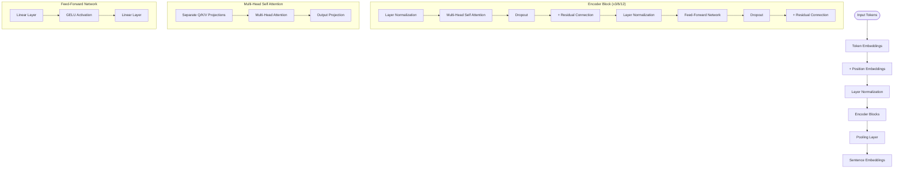
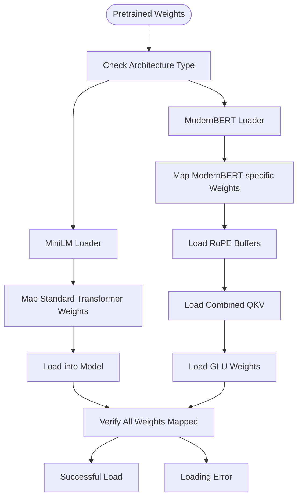

# Sentence Transformer Implementation

A clean, modular implementation of transformer models for generating sentence embeddings and text classification. This project focuses on two key transformer architectures: MiniLM and ModernBERT.

## Features

- Implementation of two distinct transformer architectures:
  - MiniLM: Efficient, lightweight transformer model
  - ModernBERT: Advanced transformer with modern architecture improvements
- Sentence embedding generation for similarity tasks
- Text classification capabilities
- Clean, modular codebase with clear separation of architectures
- Support for HuggingFace models and SafeTensors format

## Model Architectures

### MiniLM Architecture

MiniLM follows a traditional transformer design with several optimizations for efficiency:



**Key Features of MiniLM:**
- Traditional positional embeddings added to token embeddings
- Post-layer normalization (after each sub-layer)
- Separate Q/K/V projection matrices in attention mechanism
- Standard feed-forward network with GELU activation
- Available in 3 sizes: L3 (3 layers), L6 (6 layers), and L12 (12 layers)
- Hidden size of 384 (compared to BERT's 768)
- Maximum sequence length of 512 tokens
- Pooling options: CLS token or mean pooling

### ModernBERT Architecture

ModernBERT incorporates several modern improvements to the transformer architecture:


**Key Features of ModernBERT:**
- Rotary Position Embeddings (RoPE) instead of absolute position embeddings
- Pre-layer normalization (before each sub-layer)
- Combined QKV projection matrix in attention mechanism
- Gated Linear Unit (GLU) activation in feed-forward layers
- Asymmetric MLP dimensions for improved efficiency
- Support for longer contexts (up to 8192 tokens)
- No bias terms in layer normalization for stability
- Mean pooling with normalization for sentence embeddings

## Project Structure

```
sentence_transformer/
├── src/                       # Main package
│   ├── models/                # Model implementations
│   │   ├── components.py      # Shared transformer building blocks
│   │   ├── minilm/            # MiniLM specific implementation
│   │   │   └── model.py       # MiniLM model architecture
│   │   ├── modernbert/        # ModernBERT specific implementation
│   │   │   └── model.py       # ModernBERT model architecture  
│   │   └── transformer.py     # Common transformer interfaces
│   ├── utils/                 # Utilities
│   │   ├── minilm_loader.py   # MiniLM weight loading functions
│   │   ├── model_loader.py    # Generic model loading interface
│   │   ├── modernbert_loader.py # ModernBERT weight loading functions
│   │   └── tokenizer.py       # Tokenization utilities
│   ├── data_utils/            # Dataset generation and handling
│   │   └── generator.py       # Dataset generation functions
│   └── examples/              # Example applications
│       ├── text_similarity.py   # Sentence similarity example
│       ├── classification.py    # Text classification example
│       └── transformer_example.py # Combined example script
├── data/                      # Data directory for examples (CSV files)
├── generate_data.py           # Script to generate datasets
├── test_installation.py       # Script to verify installation
├── setup.py                   # Package setup file
├── requirements.txt           # Package dependencies
└── README.md                  # This file
```

## Installation

```bash
# Install from source
pip install -e .

# Install dependencies
pip install -r requirements.txt
```

## Usage

### Generate Datasets (for classification)

```bash
# Generate classification datasets
python generate_data.py
```

### Sentence Similarity

```bash
# Run text similarity example
python src/examples/transformer_example.py --mode similarity --model minilm-l6
```

### Text Classification

```bash
# First generate the datasets
python generate_data.py

# Then run text classification example
python src/examples/transformer_example.py --mode classification --model minilm-l6 --epochs 5
```

### Verify Installation

```bash
# Run quick test to verify everything works
python test_installation.py
```

## Architecture Comparison

The table below highlights the key architectural differences between MiniLM and ModernBERT:

| Feature | MiniLM | ModernBERT |
|---------|--------|------------|
| Position Encoding | Absolute embeddings | Rotary embeddings (RoPE) |
| Layer Normalization | Post-layer norm | Pre-layer norm |
| Attention Mechanism | Separate Q/K/V projections | Combined QKV projection |
| Feed-Forward Network | Standard with GELU | Gated Linear Unit (GLU) |
| MLP Dimensions | Symmetric | Asymmetric (Wi larger than Wo) |
| Sequence Length | 512 tokens | Up to 8192 tokens |
| Typical Layers | 3, 6, or 12 | 12 to 22 |
| Hidden Size | 384 | 768 |
| LN Bias | Yes | No |

## Technical Highlights

### MiniLM

MiniLM is a lightweight transformer model that distills knowledge from larger models while maintaining good performance:

1. **Efficient Knowledge Distillation**: Designed to distill knowledge from larger models like BERT
2. **Layer Configurations**: Available in 3, 6, or 12 layer variants for different tradeoffs
3. **Post-Layer Normalization**: Uses the original transformer architecture with normalization after each sublayer
4. **Pooling Strategies**: Supports both CLS token and mean pooling for sentence embeddings

### ModernBERT

ModernBERT incorporates several architectural innovations that have emerged since the original transformer architecture:

1. **Rotary Position Embeddings (RoPE)**: Instead of adding absolute position embeddings, ModernBERT uses rotation matrices that modify query and key vectors directly within the attention mechanism, enabling better extrapolation to longer sequences.

2. **Gated Linear Units (GLU)**: The traditional feed-forward network is replaced with a gated architecture:
   ```
   FFN(x) = (xWi1 * SiLU(xWi2)) * Wo
   ```
   Where Wi1 and Wi2 are computed from a single larger projection, and SiLU is the Sigmoid Linear Unit activation function.

3. **Pre-Layer Normalization**: Layer normalization is applied before each sublayer rather than after, improving training stability.

4. **Combined QKV Projection**: Uses a single projection matrix for Q, K, and V, which is then split, reducing parameter count.

5. **Normalized Mean Pooling**: Uses mean pooling with normalization for improved sentence embeddings.

## Model Selection Guide

| Model | Description | Parameters | Best For |
|-------|-------------|------------|----------|
| minilm-l3 | 3-layer model (fastest) | ~14M | Resource-constrained environments, edge devices |
| minilm-l6 | 6-layer model (balanced) | ~23M | General-purpose use, balanced performance |
| minilm-l12 | 12-layer model (highest quality) | ~33M | High-quality embeddings, similarity tasks |
| modernbert | Advanced transformer architecture | ~110M | State-of-the-art performance, longer contexts |

## Code Examples

### MiniLM Example

```python
from src.models.minilm import create_minilm_model
from src.utils import get_tokenizer_for_model, load_pretrained_weights

# Create model and tokenizer
model = create_minilm_model(num_layers=6)
tokenizer = get_tokenizer_for_model("minilm-l6")

# Load weights
model = load_pretrained_weights(model, "all-MiniLM-L6-v2")

# Generate embeddings
texts = ["This is a sample sentence.", "Another example text."]
encoded = tokenizer.encode(texts)
embeddings = model(encoded['input_ids'], encoded['attention_mask'])

# Calculate similarity
import torch
cosine = torch.nn.CosineSimilarity(dim=1)
similarity = cosine(embeddings[0].unsqueeze(0), embeddings[1].unsqueeze(0))
print(f"Similarity: {similarity.item():.4f}")
```

### ModernBERT Example

```python
from src.models.modernbert import create_modernbert_model
from src.utils import get_tokenizer_for_model, load_pretrained_weights

# Create model and tokenizer
model = create_modernbert_model()
tokenizer = get_tokenizer_for_model("modernbert")

# Load weights
model = load_pretrained_weights(model, "modernbert-base")

# Generate embeddings (supports longer sequences)
texts = ["This is a detailed technical document...", "Another complex text with many details..."]
encoded = tokenizer.encode(texts, max_length=2048, truncation=True)
embeddings = model(encoded['input_ids'], encoded['attention_mask'])

# Calculate similarity
import torch
cosine = torch.nn.CosineSimilarity(dim=1)
similarity = cosine(embeddings[0].unsqueeze(0), embeddings[1].unsqueeze(0))
print(f"Similarity: {similarity.item():.4f}")
```

## Implementation Details

### Weight Loading

One of the key technical challenges in this project is correctly loading weights from pretrained models into our implementations:



#### MiniLM Weight Loading

MiniLM uses a standard transformer architecture, making weight loading straightforward:
- Direct 1:1 mapping between source and target parameters
- Standard naming conventions (query, key, value projections)
- Conventional position embeddings
- Typical layer normalization parameters

#### ModernBERT Weight Loading

ModernBERT requires special handling for its architectural innovations:

1. **Rotary Embeddings**: Instead of loading learned position embeddings, we:
   - Register cos/sin buffers based on the model's configuration
   - Compute these values during initialization rather than loading them
   - Use appropriate frequency calculations for positional encoding

2. **Combined QKV Handling**: When loading weights:
   - Convert separate Q/K/V matrices to combined format if needed
   - Handle dimension rearrangement for multi-head attention
   - Support different head dimensions between source and target

3. **GLU Weights**: For the gated feed-forward networks:
   - Split larger Wi matrix into two parts (gate and value paths)
   - Handle asymmetric dimensions between input and output projections
   - Map activation functions appropriately (GELU/SiLU)

4. **Parameter Grouping**: For fine-tuning we use:
   - Separate parameter groups for encoder vs. classifier layers
   - Different learning rates for different parameter groups
   - Layer-dependent learning rate decay for deeper transformer models

## Performance Considerations

- **MiniLM**: Optimized for efficiency and smaller model size
  - Uses approximately 1/4 the parameters of BERT-base
  - Suitable for resource-constrained environments
  - Good balance of performance and speed

- **ModernBERT**: Optimized for quality and long-sequence handling
  - Advanced architecture with better scaling properties
  - State-of-the-art performance on many NLP tasks
  - Can handle significantly longer contexts (up to 8192 tokens)
  - More computationally intensive, but higher quality output

## PyTorch Implementation Guide

This codebase serves as a practical guide to implementing transformer architectures in PyTorch. Below we highlight key implementation patterns and techniques that can help others understand how to build efficient, modular transformer models.

### Core PyTorch Patterns

Throughout this codebase, we demonstrate several key PyTorch implementation patterns:

1. **Module Composition**
   ```python
   class TransformerEncoder(nn.Module):
       def __init__(self, config):
           super().__init__()
           self.layers = nn.ModuleList([
               TransformerLayer(config) for _ in range(config.num_layers)
           ])
   ```

2. **Tensor Manipulation**
   ```python
   # Reshaping for multi-head attention
   def reshape_for_attention(x, batch_size, num_heads, head_dim):
       # [batch_size, seq_len, hidden_size] -> [batch_size, seq_len, num_heads, head_dim]
       x = x.view(batch_size, -1, num_heads, head_dim)
       # [batch_size, seq_len, num_heads, head_dim] -> [batch_size, num_heads, seq_len, head_dim]
       return x.permute(0, 2, 1, 3)
   ```

3. **Parameter Registration**
   ```python
   # Register learned parameters
   self.query = nn.Linear(hidden_size, hidden_size)
   
   # Register non-learned buffers
   self.register_buffer("cos_cached", cos_cached, persistent=False)
   self.register_buffer("sin_cached", sin_cached, persistent=False)
   ```

4. **Using Einsum for Clean Tensor Operations**
   ```python
   # Using einsum for matrix multiplication with clear dimension labeling
   attention_scores = torch.einsum('bhld,bhmd->bhlm', query, key)
   ```

### Implementing Rotary Position Embeddings (RoPE)

Rotary Position Embeddings are a key innovation in ModernBERT. Below we explain the PyTorch implementation:

```python
class ModernBERTRotaryEmbedding(nn.Module):
    def __init__(self, dim, max_seq_len=8192, base=10000):
        super().__init__()
        # Compute frequency bands
        inv_freq = 1.0 / (base ** (torch.arange(0, dim, 2).float() / dim))
        self.register_buffer("inv_freq", inv_freq)
        
        # Pre-compute cos and sin values for positions
        t = torch.arange(max_seq_len, dtype=inv_freq.dtype)
        freqs = torch.einsum("i,j->ij", t, self.inv_freq)
        emb = torch.cat((freqs, freqs), dim=-1)
        
        # Register as buffers (not parameters) since they're not learned
        self.register_buffer("cos_cached", emb.cos()[None, None, :, :], persistent=False)
        self.register_buffer("sin_cached", emb.sin()[None, None, :, :], persistent=False)
```

The application of RoPE to query and key tensors is implemented as:

```python
def apply_rotary_pos_emb(q, k, cos, sin, position_ids=None):
    # Extract batch, sequence, and head dimensions
    batch_size, seq_length, num_heads, head_dim = q.shape
    
    # Get cos and sin for specific positions if needed
    if position_ids is not None:
        cos = cos.index_select(2, position_ids)
        sin = sin.index_select(2, position_ids)
    
    # Reshape tensors for efficient application
    cos = cos[:, :, :seq_length]
    sin = sin[:, :, :seq_length]
    
    # Apply rotary embeddings using complex number properties
    # For even indices: q_even, q_odd = q[..., 0::2], q[..., 1::2]
    # rotate: (q_even*cos - q_odd*sin, q_odd*cos + q_even*sin)
    q_embed = (q * cos) + (rotate_half(q) * sin)
    k_embed = (k * cos) + (rotate_half(k) * sin)
    
    return q_embed, k_embed
```

Key PyTorch techniques demonstrated:

1. **Efficient Parameter Registration**: We use `register_buffer` instead of `nn.Parameter` for the cos/sin values since they're not learned.
2. **Einsum for Clear Tensor Operations**: Using `torch.einsum` makes the mathematical operations clearer.
3. **Broadcasting**: PyTorch's broadcasting capabilities simplify applying the rotations to different batch elements.
4. **Persistent Buffers**: Using `persistent=False` ensures these values don't get saved in the state dict.

### Implementing Gated Linear Units (GLU)

The GLU implementation in ModernBERT's feed-forward network shows several advanced PyTorch patterns:

```python
class ModernBERTMLP(nn.Module):
    def __init__(self, config):
        super().__init__()
        self.hidden_size = config.hidden_size
        # Asymmetric MLP dimensions (common in modern architectures)
        # Input projection is twice the intermediate size for the gate mechanism
        self.intermediate_size = config.intermediate_size
        
        # Single projection that produces both gate and value paths
        self.gate_proj = nn.Linear(self.hidden_size, 2 * self.intermediate_size, bias=False)
        # Output projection back to hidden dimension
        self.out_proj = nn.Linear(self.intermediate_size, self.hidden_size, bias=False)
        
        # Activation function for gating
        self.act_fn = nn.SiLU()

    def forward(self, hidden_states):
        # Project to intermediate representation (twice the size for gating)
        hidden_gelu = self.gate_proj(hidden_states)
        
        # Split into two equal halves for gate and value
        hidden_act, hidden_linear = hidden_gelu.chunk(2, dim=-1)
        
        # Apply activation only to the gating half
        hidden_act = self.act_fn(hidden_act)
        
        # Element-wise multiplication (gating mechanism)
        hidden_states = hidden_act * hidden_linear
        
        # Project back to hidden dimension
        hidden_states = self.out_proj(hidden_states)
        
        return hidden_states
```

Key PyTorch techniques demonstrated:

1. **Tensor Chunking**: Using `chunk()` to efficiently split a tensor along a dimension.
2. **Asymmetric Projections**: Creating different sized projections for input and output.
3. **Element-wise Operations**: Using broadcast multiplication for the gating mechanism.
4. **Efficient Parameter Usage**: Combining multiple projections into one larger projection when possible.

### Attention Implementation with PyTorch

The attention mechanism in ModernBERT showcases efficient PyTorch implementation:

```python
class ModernBERTAttention(nn.Module):
    def __init__(self, config):
        super().__init__()
        self.hidden_size = config.hidden_size
        self.num_heads = config.num_attention_heads
        self.head_dim = self.hidden_size // self.num_heads
        
        # Combined QKV projection (more efficient than separate)
        self.qkv_proj = nn.Linear(self.hidden_size, 3 * self.hidden_size, bias=False)
        self.out_proj = nn.Linear(self.hidden_size, self.hidden_size, bias=False)
        
        # Rotary embeddings for positional information
        self.rotary_emb = ModernBERTRotaryEmbedding(self.head_dim)
        
        # Attention scaling factor
        self.scale = self.head_dim ** -0.5
        
    def forward(self, hidden_states, attention_mask=None):
        batch_size, seq_length = hidden_states.shape[:2]
        
        # Combined QKV projection
        qkv = self.qkv_proj(hidden_states)
        
        # Reshape and split into Q, K, V
        qkv = qkv.view(batch_size, seq_length, 3, self.num_heads, self.head_dim)
        qkv = qkv.permute(2, 0, 1, 3, 4)
        query, key, value = qkv[0], qkv[1], qkv[2]
        
        # Apply rotary embeddings
        query, key = apply_rotary_pos_emb(
            query, key, 
            self.rotary_emb.cos_cached, 
            self.rotary_emb.sin_cached
        )
        
        # Calculate attention scores
        attention_scores = torch.matmul(query, key.transpose(-1, -2)) * self.scale
        
        # Apply attention mask if provided
        if attention_mask is not None:
            attention_scores = attention_scores + attention_mask
            
        # Softmax normalization
        attention_probs = F.softmax(attention_scores, dim=-1)
        
        # Compute context from attention and values
        context = torch.matmul(attention_probs, value)
        context = context.permute(0, 2, 1, 3).contiguous()
        context = context.view(batch_size, seq_length, self.hidden_size)
        
        # Final projection
        output = self.out_proj(context)
        
        return output
```

Key PyTorch techniques demonstrated:

1. **Efficient Tensor Reshaping**: Using `view`, `permute`, and `transpose` for dimension manipulations.
2. **Masked Operations**: Implementing attention masking using addition of mask values.
3. **Batched Matrix Multiplication**: Using `torch.matmul` for efficient batched operations.
4. **Memory Optimization**: Using `contiguous()` to ensure efficient memory layout after permutations.

### PyTorch Optimizations for Training

The codebase also demonstrates training optimizations in PyTorch:

```python
# Creating separate optimizer parameter groups
encoder_params = [p for n, p in model.named_parameters() if "classifier" not in n]
classifier_params = [p for n, p in model.named_parameters() if "classifier" in n]

optimizer = torch.optim.AdamW([
    {'params': encoder_params, 'lr': learning_rate},
    {'params': classifier_params, 'lr': learning_rate * 5}  # Higher LR for classifier
], weight_decay=0.01)

# Learning rate scheduler with warmup
scheduler = get_linear_schedule_with_warmup(
    optimizer, 
    num_warmup_steps=100, 
    num_training_steps=num_epochs * len(train_dataloader)
)
```

Key PyTorch techniques demonstrated:

1. **Parameter Grouping**: Creating groups of parameters that receive different learning rates.
2. **Named Parameters Access**: Using `named_parameters()` to filter parameters by name.
3. **Custom Schedulers**: Implementing learning rate schedules with warmup periods.
4. **Optimizer Configuration**: Setting weight decay and other hyperparameters appropriately.

### Efficient Weight Loading with PyTorch

The weight loading mechanism shows advanced PyTorch state_dict handling:

```python
# Loading weights with verification
def load_pretrained_weights(model, pretrained_model_name):
    # Load pretrained weights
    state_dict = torch.load(f"pretrained/{pretrained_model_name}.safetensors")
    
    # Map weights based on architecture type
    if "modernbert" in pretrained_model_name:
        mapped_weights = map_modernbert_weights(state_dict, model.state_dict())
    else:
        mapped_weights = map_minilm_weights(state_dict, model.state_dict())
    
    # Load weights and verify
    missing, unexpected = model.load_state_dict(mapped_weights, strict=False)
    
    # Calculate loading stats
    total_params = len(model.state_dict())
    loaded_params = total_params - len(missing)
    print(f"Loaded {loaded_params}/{total_params} parameters ({loaded_params/total_params:.1%})")
    
    return model
```

Key PyTorch techniques demonstrated:

1. **State Dict Manipulation**: Working with model state dictionaries to map weights.
2. **Non-strict Loading**: Using `strict=False` to handle partial weight loading.
3. **Loading Verification**: Checking missing and unexpected keys for debugging.
4. **Architecture-specific Handling**: Custom mapping functions for different architectures.

## Mathematical Background

Understanding the mathematical foundations behind the architectural innovations is key to properly implementing them in PyTorch.

### RoPE: Rotary Position Embedding Mathematics

Rotary Position Embeddings (RoPE) encode absolute positional information into query and key vectors via rotation matrices. The mathematical formulation is as follows:

1. **Rotation in 2D Space**:
   For each pair of adjacent dimensions (2d, 2d+1) in the embedding, we apply a rotation based on position:

   ```
   [x_{2d}, x_{2d+1}] → [x_{2d}cos(mθ) - x_{2d+1}sin(mθ), x_{2d}sin(mθ) + x_{2d+1}cos(mθ)]
   ```

   Where:
   - m is the position in the sequence
   - θ is the base rotation angle calculated as θ_d = 10000^(-2d/D)
   - D is the total embedding dimension

2. **Frequency Calculation**:
   The base frequencies are calculated as:
   
   ```
   f_d = 1/10000^(2d/D)
   ```
   
   This creates a geometric sequence of frequencies, similar to sinusoidal position embeddings but applied through rotation.

3. **Complex Number Representation**:
   The rotation can be viewed as multiplying by a complex number e^(imθ):
   
   ```
   (x_{2d} + ix_{2d+1}) × e^(imθ) = (x_{2d} + ix_{2d+1})(cos(mθ) + isin(mθ))
   ```
   
   In our PyTorch implementation, we decompose this complex multiplication into real-valued operations.

4. **Relative Position Properties**:
   When computing attention scores, RoPE preserves relative position information:
   
   ```
   q_m·k_n = ReΦ(q_m)ᵀReΦ(k_n) = g(m-n, q, k)
   ```
   
   Where Φ is the rotary encoding function. This means that the attention score between positions m and n depends only on their relative distance (m-n).

### GLU: Gated Linear Units Mathematics

Gated Linear Units (GLU) replace traditional feed-forward networks with a gated architecture. The mathematical formulation is:

1. **Traditional FFN**:
   ```
   FFN(x) = Activation(xW₁ + b₁)W₂ + b₂
   ```

2. **GLU Architecture**:
   ```
   GLU(x) = (xW_a ⊙ σ(xW_g))W_o + b_o
   ```
   
   Where:
   - W_a is the value projection
   - W_g is the gate projection
   - σ is an activation function (often SiLU/Swish)
   - ⊙ is element-wise multiplication

3. **Combined Input Projection**:
   For efficiency, many implementations combine W_a and W_g into a single larger matrix W_i:
   
   ```
   [xW_a, xW_g] = xW_i
   ```
   
   Then we split the result and apply the activation to only one part.

4. **SiLU/Swish Activation**:
   ```
   SiLU(x) = x * sigmoid(x) = x * (1 / (1 + e^(-x)))
   ```
   
   This activation function has properties that work well with the gating mechanism.

5. **Asymmetric Dimensions**:
   In ModernBERT, the intermediate size (dimension of W_a and W_g outputs) is larger than both input and output:
   
   ```
   x ∈ ℝᵈ → W_i ∈ ℝᵈˣ²ʰ → split → W_a(x), W_g(x) ∈ ℝʰ → gate → W_o ∈ ℝʰᵏ → out ∈ ℝᵏ
   ```
   
   Where typically d = k = 768 and h = 1152 (or 2304 for the combined projection).

The effectiveness of GLU comes from its ability to dynamically control information flow through the network by learning which information to retain through the gating mechanism.

## License

This project is licensed under the MIT License - see the LICENSE file for details.