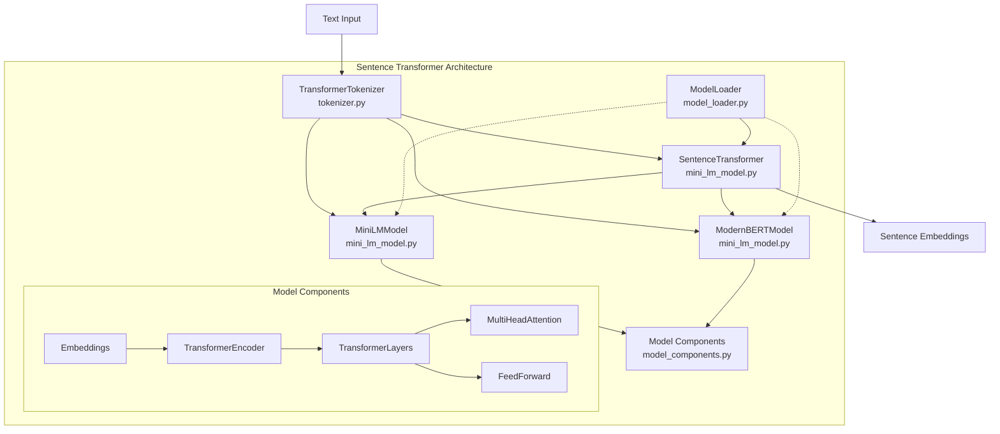

# Sentence Transformer Implementation

A PyTorch implementation of transformer models for generating sentence embeddings, supporting multiple model variants including:

## MiniLM Models
- `paraphrase-MiniLM-L3-v2`
- `all-MiniLM-L6-v2` (default)
- `paraphrase-MiniLM-L6-v2`
- `all-MiniLM-L12-v2`

## ModernBERT Models
- `modernbert-base`

This implementation provides efficient sentence embedding generation with customizable parameters, making it suitable for both experimentation and production use.

## Features

- Custom PyTorch implementation of transformer architectures (MiniLM and ModernBERT)
- Support for multiple model variants (MiniLM L3, L6, L12 and ModernBERT)
- Loading pretrained weights from HuggingFace models
- Unified tokenizer that works with any HuggingFace tokenizer
- Configurable sequence length and model parameters
- GPU/MPS acceleration with automatic device detection
- Robust parameter validation and error checking

## Requirements

```
torch>=1.7.0
transformers>=4.6.0
numpy>=1.19.0
```

## Architecture



### Core Modules

- **model_components.py**: Transformer building blocks (Embeddings, Attention, etc.)
- **mini_lm_model.py**: Core model implementations (`MiniLMModel`, `ModernBERTModel`, `SentenceTransformer`)
- **model_loader.py**: Handles loading pretrained weights from different model types
- **tokenizer.py**: Unified tokenizer interface for different model types
- **usage_example.py**: Command-line interface and usage examples

### Data Flow

1. **Text → Embeddings**:
   - Text input → Tokenizer → Token IDs & attention mask
   - Token IDs → Embeddings → Transformer layers → Mean pooling → Normalized sentence embeddings

2. **Weight Loading**:
   - HuggingFace model → Custom architecture mapping → Parameter validation → Loaded weights

## Environment Setup

1. Set up the environment variable for model paths:
```bash
# All models are stored in subdirectories of LLM_MODELS_PATH
export LLM_MODELS_PATH=/path/to/your/models
```

2. Install the required packages:
```bash
pip install -r requirements.txt
```

3. Download model files:
   - MiniLM models from HuggingFace to their respective subdirectories (e.g., all-MiniLM-L6-v2) of your LLM_MODELS_PATH
   - ModernBERT model should be located at `$LLM_MODELS_PATH/ModernBERT-base`

## Usage

### Basic Usage

```python
from mini_lm_model import SentenceTransformer
from tokenizer import TransformerTokenizer
from model_loader import load_pretrained_weights
import torch

# For MiniLM models
model = SentenceTransformer(model_type="minilm", num_hidden_layers=6, max_length=64)
tokenizer = TransformerTokenizer(model_name="all-MiniLM-L6-v2", model_type="minilm", max_length=64)
model = load_pretrained_weights(model, model_name="all-MiniLM-L6-v2", model_type="minilm")

# OR for ModernBERT models
# model = SentenceTransformer(model_type="modernbert", max_length=512)
# tokenizer = TransformerTokenizer(model_name="modernbert", model_type="modernbert", max_length=512)
# model = load_pretrained_weights(model, model_name="modernbert", model_type="modernbert")

# Prepare sentences
sentences = [
    "The quick brown fox jumps over the lazy dog",
    "I love natural language processing"
]

# Tokenize sentences
encoded_input = tokenizer.encode(sentences)

# Move to appropriate device (CUDA, MPS, or CPU)
device = torch.device("cuda" if torch.cuda.is_available() else 
                     "mps" if torch.backends.mps.is_available() else 
                     "cpu")
model.to(device)
encoded_input = {k: v.to(device) for k, v in encoded_input.items()}

# Generate embeddings
with torch.no_grad():
    embeddings = model(encoded_input["input_ids"], encoded_input["attention_mask"])
```

### Command-Line Usage

```bash
# Default: MiniLM model
python usage_example.py --model all-MiniLM-L6-v2 --model_type minilm --max_length 128

# Using ModernBERT model
python usage_example.py --model modernbert --model_type modernbert --max_length 512
```

## Model Selection Guide

| Model | Layers | Hidden Size | Parameters | Best For |
|-------|--------|-------------|------------|----------|
| **MiniLM Models** |
| paraphrase-MiniLM-L3-v2 | 3 | 384 | ~22M | Fast inference, low resources |
| all-MiniLM-L6-v2 | 6 | 384 | ~33M | Balanced performance (default) |
| paraphrase-MiniLM-L6-v2 | 6 | 384 | ~33M | Better paraphrase quality |
| all-MiniLM-L12-v2 | 12 | 384 | ~55M | Higher quality embeddings |
| **ModernBERT Models** |
| modernbert-base | 12 | 768 | ~110M | State-of-the-art embeddings, advanced semantic understanding |

## License

This project is licensed under the MIT License - see the [LICENSE](LICENSE) file for details.

## Acknowledgments

This implementation is based on:
- The MiniLM architecture from Microsoft Research 
- The ModernBERT architecture
- The HuggingFace Transformers library for tokenizers and model interfaces